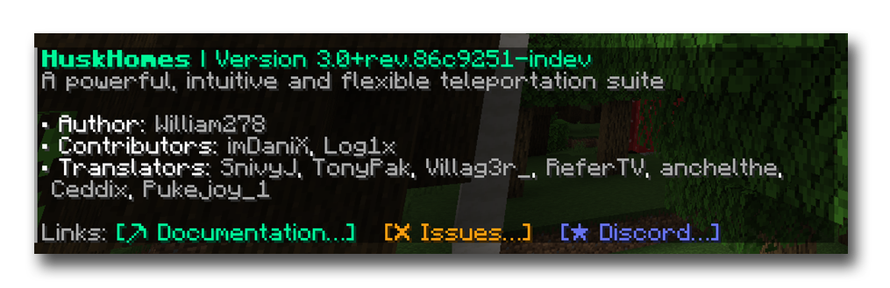

# DesertWell
[](https://discord.gg/tVYhJfyDWG)
[](https://jitpack.io/#net.william278/DesertWell)

DesertWell is a simple library providing various utilities to aid Minecraft plugin development. Requires Java 11+.



## Features
### About menus
`AboutMenu.class` allows for the generation of plugin about menus, as seen above.

To create an about menu, use `AboutMenu#create(title)` with the resource name, then use the various builder methods to 
build out the menu.

<details>
<summary>Code snippet</summary>

```java
public class ExamplePlugin extends JavaPlugin {

    // Displays the about menu to the player and logs it to console
    public void showAboutMenu(Player player) {
        final AboutMenu menu = AboutMenu.create("Example")
                .withDescription("A powerful, intuitive and flexible teleportation suite")
                .withVersion(Version.fromString(plugin.getDescription().getVersion()))
                .addAttribution("Author",
                AboutMenu.Credit.of("William278").withDescription("Click to visit website").withUrl("https://william278.net"))
                .addAttribution("Contributors",
                        AboutMenu.Credit.of("Contributor 1").withDescription("Code, refactoring")
                .addAttribution("Translators",
                        AboutMenu.Credit.of("Translator 1").withDescription("Spanish (es-es)"),
                        AboutMenu.Credit.of("Translator 2").withDescription("Italian (it-it)")
                .addButtons(
                        AboutMenu.Link.of("https://william278.net/").withText("Wesbite").withIcon("⛏"),
                        AboutMenu.Link.of("https://discord.gg/tVYhJfyDWG").withText("Discord").withIcon("⭐").withColor("#6773f5"))));

        // Display the menu to the player
        player.spigot().sendMessage(menu.toMineDown().toComponents());
        
        // Use #toString to get a console-friendly version of the menu
        getLogger().info(AboutMenu.toString());
    }

}
```
</details>

### Version
`Version.class` provides a simple way to compare semantic plugin and Minecraft versions. `VersionChecker.class` provides 
a utility for querying Spigot resources for the latest version of a plugin and comparing with the current version in
order to check for updates.

<details>
<summary>Code snippet</summary>

```java
public class ExamplePlugin extends JavaPlugin {

    // Checks for updates and logs to console
    public void checkForUpdates() {
        final int spigotResourceId = 97144;
        final UpdateChecker updateChecker = UpdateChecker.create(Version.fromString("1.0.0"), spigotResourceId);
        updateChecker.isUpToDate().thenAccept(upToDate -> {
            if (upToDate) {
                getLogger().info("Running the latest version (" + updateChecker.getCurrentVersion() + ").");
            } else {
                getLogger().info("An update is available! Download from: https://www.spigotmc.org/resources/" + spigotResourceId);
            }
        });
    }

}
```
</details>

## Installation
DesertWell is available on JitPack. You can browse the Javadocs [here](https://javadoc.jitpack.io/net/william278/DesertWell/latest/javadoc/).

Note that your plugin will also need to shade (or shade a library that includes) [MineDown](https://github.com/Phoenix616/MineDown).

<details>
<summary>Maven</summary>

To include the library with Maven, in your `pom.xml` file, first add the JitPack repository:
```xml
    <repositories>
        <repository>
            <id>jitpack.io</id>
            <url>https://jitpack.io</url>
        </repository>
    </repositories>
```

Then, add the dependency in your `<dependencies>` section. Remember to replace `Tag` with the current DesertWell version.
```xml
    <dependency>
        <groupId>net.william278</groupId>
        <artifactId>DesertWell</artifactId>
        <version>Tag</version>
        <scope>compile</scope>
    </dependency>
```
</details>

### Gradle & others
JitPack has a [handy guide](https://jitpack.io/#net.william278/DesertWell/#How_to) for how to use the dependency with other build platforms.

## License
DesertWell is licensed under Apache-2.0.